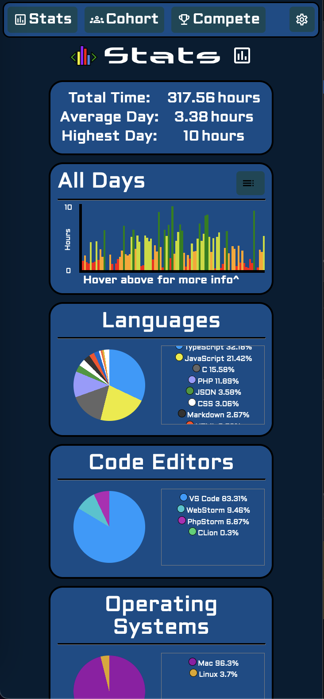
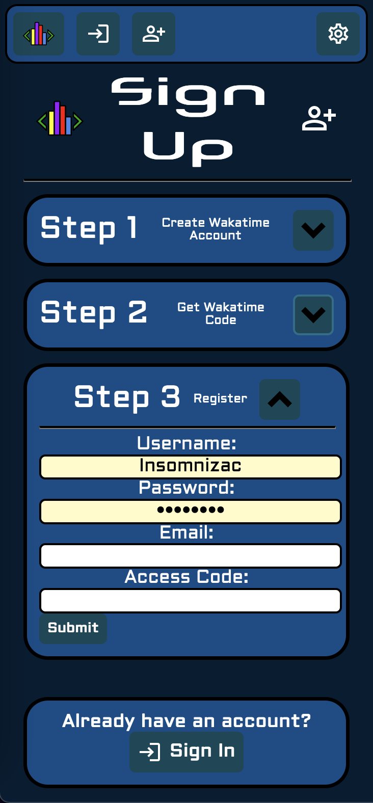

# SE26 Code Tracker
### Integrated with the Wakatime JSON API, this code tracker allows for the premium features of Wakatime, as well as additional graphs and data for groups, specially designed for the University of Waterloo Software Engineering Cohort of 2026.
 
 

<table width="100%">
	<tbody>
		<tr>
			<td width="25%"></td>
			<td width="25%"><h3>Developed by Zac Waite</h3></td>
			<td width="25%">
				
			</td>
			<td width="25%"></td>
		</tr>
	</tbody>
</table>